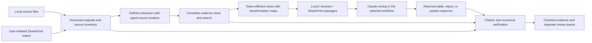

# DocIQ — scope, governance, and architecture audit

Prepared for Alex Bachowski after the scope interview. September 9, 2026.

## Verdict

**Retain the proven preparation safeguards, but substantially restructure the evidence model and add a real verification workflow.** The current application is a foundation for the confirmed product, not a nearly finished implementation of it. A complete rewrite is not yet justified: replacement components have not demonstrated better results, while the existing system already contains useful handling of failures, page accounting, approvals, identity, and packaging.

Token efficiency and citation reliability are coequal product goals. The previous context-window objective is explicitly withdrawn. The preferred design is a local evidence-preparation and checking application with a separately controlled SharePoint connection, optional later AI integration, and compatible exports for the three Claude workflows.

This recommendation follows the [confirmed interview scope](confirmed_scope_after_interview_2026-09-09.md). Historical restrictions are not treated as stronger authority than Alex's current answers. Conversely, capabilities newly requested in the interview are labeled scope additions, not faults that the earlier developers should have anticipated.

## Scope, method, and limits

- Inspected `C:/Users/Alex/document-iq`, branch `build/sprint-5`, commit `5f18928`. GitHub's branch reference matched; GitHub main was `6e119a5`. Application code was unchanged during review.
- Read the requirements, README, architecture, handoff, decision register, contract freeze and amendments, packaging instructions, acceptance evidence, relevant review history, inherited Claude instructions, and implementation paths for extraction, identity, omissions, emission, GUI, and verification.
- Used the CLAUDE.md audit skill and its quality rubric for instruction discovery and assessment. No project CLAUDE.md was found. The inherited `C:/Users/Alex/CLAUDE.md` was inspected; it is outside this repository.
- The earlier review ran 167 selected tests successfully and reproduced the three fidelity defects below in memory. The source commit is unchanged. This audit also reproduced the amendment checker's unavailable-Git behavior using an in-memory mock and runs the complete existing test suite; the exact result is recorded in the validation addendum.
- Did not run the representative real corpus, operate the packaged GUI, inspect the corporate SharePoint tenant, or execute the actual Claude mining workflow. No client document was sent to an external service. Generic implementation claims were checked against official vendor documentation.

This is a targeted product, governance, and architecture audit. It is not a claim of exhaustive code correctness, legal defensibility, or demonstrated production performance.

## What Claude built that should be kept

| Existing asset | Why it is useful | Limit on reuse |
|---|---|---|
| Page/document records with validation and original PDF ordinals | Provides a consistent basis for accounting and provenance. | Extend with source versions, typed locations, blocks, and source-to-text mappings; an ordinal alone is insufficient. |
| Default KEEP and person-attributed omissions | Aligns with explicit approval for substantive exclusions. | Omissions should define a view over retained evidence; approval alone does not prove a section boundary is correct. |
| Bounded section spans and recognition fingerprints | Addresses prior overbroad drops and configuration-dependent approval mistakes. | Section families are not verified source section numbers; preserve the original heading independently. |
| File hashes, master-index matching, container parent links | Useful evidence lineage and reconciliation primitives. | Add persistent identity/version history; hashes do not retain original bytes or establish quotation accuracy. |
| Resume checks and bounded in-flight extraction | Avoids needless recovery work and unbounded submission of files. | The entire collection's records are still accumulated; resume is not a scalable versioned evidence store. |
| Pipeline/GUI separation and adapter | Provides a seam for replacing storage and adding verification without a wholesale UI/engine rewrite. | The user workflow needs source inspection and review resolution, not just more summary labels. |
| Failure-state, accounting, import-boundary, and amendment tests | Many earlier defects have explicit regression coverage. | Passing these checks does not establish semantic fidelity, citation accuracy, or complete mining. |
| Packaged executable diagnostics and local OCR | Useful for deployment without a separate Python installation and for local processing. | Test the actual final package; a source test result is not a release-package result. |

The decision history is also valuable: it records corrections, measured limitations, and owner-approved deferrals. Preserve it as history. Its length and mixed current/historical status make it unsuitable as the only operational specification.

## Confirmed problems and material gaps

### F-01 — extraction can alter or lose the evidence before citation checks start

Three synthetic cases were reproduced against the current source:

| Case | Observed result | Source |
|---|---|---|
| PDF with a native header over 40 characters and substantive text in an image | No OCR requested; substantive image text absent; no document note identifying that omission. The probe monitored the OCR call, not OCR quality. | [extract.py:1286](../../src/dociq/ingest/extract.py#L1286) |
| Word paragraph, table, then paragraph | Extracted as both paragraphs followed by the table, changing reading order. | [extract.py:1406](../../src/dociq/ingest/extract.py#L1406) |
| Excel formula with no saved calculation result | Formula and result absent from text; only the general worksheet-pagination note emitted. | [extract.py:1443](../../src/dociq/ingest/extract.py#L1443) |

These are present-code defects relevant to the original preparation purpose, not merely new feature requests. Correct them with source-aware extraction, typed blocks/cells, and explicit coverage signals. Retain original evidence for comparison. Do not rely on a mean OCR confidence score to certify a date, number, or quotation.

### F-02 — current locators cannot implement the confirmed citation standard

`PageRecord` stores page number, text, Bates value, section label/tier, and disposition. It does not provide a source-location model for PDF physical page versus printed page label, Word blocks, spreadsheet cells, and source regions. Synthetic sources still emit generic PAGE markers; `sources.json` maps document IDs to reduced text paths. See [contracts.py:437](../../src/dociq/contracts.py#L437) and [cleantext.py:51](../../src/dociq/emit/cleantext.py#L51).

**Required change:** make a source locator a first-class record, independent of the format used to show it to Claude. Keep exact original headings/section numbers separate from normalized recognition categories. Citation-ready blocks must carry reference IDs that the verifier can resolve without asking Claude to reconstruct page or section numbers.

### F-03 — no implemented returned-report citation verifier was found

The existing `verify/` modules check accounting, manifests, repeatability, token estimates, and offline behavior. Those are preparation checks. They do not implement report/table ingestion, quotation matching, source-location correction, numerical context checking, independent calculation, or uncited-claim review.

This is principally **newly confirmed scope**. It requires an explicit verification subsystem and user workflow, not an extra assertion in the existing page-accounting gate.

### F-04 — a reduced export is not a durable, complete evidence collection

DROP pages are skipped by the clean-text renderer. The source originals are not thereby deleted, but the convenient downstream manifest points to the reduced text. There is no general source-to-compacted-text map for quotations whose representation changes.

**Required change:** retain original source versions and a full extraction representation. Derive named views and compact exports from them. Record every transformation and exclusion. Omitted material remains discoverable in the full authorized collection. Search results and coverage reports must identify which view was used.

### F-05 — unchanged-input determinism is not citation stability over time

Unmatched DIQ identifiers are allocated from a counter over the current document ordering. Adding an earlier-sorting document can shift subsequent identifiers. Current output publication replaces prior deliverables; the shared staging folder has no inter-process writer lock, a risk explicitly recorded in the Sprint-4 close-out. See [assign.py:521](../../src/dociq/docid/assign.py#L521), [paths.py:309](../../src/dociq/emit/paths.py#L309), and [the close-out](../decisions/sprint4_closeout_2026-08-19.md).

**Required change:** persistent source occurrence IDs, source-version hashes, human-friendly LI/DIQ aliases, immutable completed collection versions, and a single-writer guard. Keep the previous valid published version when an update fails. A citation binds to a completed source version, not whichever file currently occupies a familiar path. This changes an owner-accepted older publication design because the newly confirmed requirements need durable history.

### F-06 — token efficiency is estimated, not demonstrated on equivalent mining tasks

The requirements describe tokenizer calibration; `verify/tokens.py` explicitly says that calibration was not performed. The implementation has extensive capacity-reference presentation. No inspected acceptance evidence compares actual mining token use, recovered evidence, and citation accuracy before and after preparation.

**Required change:** remove context-capacity success/failure framing from requirements, UI, summaries, and acceptance. Retain clearly labeled size estimates where useful. Preserve task token efficiency as a headline result alongside verification and coverage. Measure reduction in tokens for equivalent mining outcomes; do not substitute file-size reduction, omitted-page counts, or an uncalibrated ratio for actual usage.

### F-07 — SharePoint requires a new, controlled boundary

No SharePoint connector, Graph authentication, permission-preserving publisher, or remote source-version model was found in the inspected source. The existing no-network product rule intentionally excludes these.

**Required change:** local preparation/checking remains isolated from a user-initiated connector. Download explicitly selected source versions, record identity/hash, process locally, and publish checked packages to approved destinations. Each published package is a new permission-bearing object; it does not inherit all original source restrictions merely because it contains source links.

Automatic monitoring and background publishing are deferred. A company service is not required for the launch design now selected. SharePoint still requires company identity/consent configuration; “no Anthropic API key” does not mean “no authentication or IT setup.”

### F-08 — current data flow is not evidence of 100,000-page or million-page readiness

The walker bounds in-flight submissions, which is good, but keeps collection-wide document/page records and produced results in memory. Files are read into bytes for extraction. Historical full-corpus evidence is approximately 18,556 pages, with documented contention/timeouts. That is not a measured launch-scale result. See [walker.py:1313](../../src/dociq/ingest/walker.py#L1313).

**Required change:** persist extraction per source version, page/block indexes, bounded worker memory, checkpoints, and incremental export/verification. Benchmark realistic mixes at launch scale, including failures and changes. Isolate hung extraction work if measurements show threads cannot be stopped cleanly enough. Keep storage and job interfaces replaceable for future scale; do not promise a million-page service because the design uses a database.

## Governance audit

### Instruction discovery and CLAUDE.md quality report

Project instruction files found: **0** (`CLAUDE.md`, local variants, and `AGENTS.md` were not found in the inspected repository). One applicable ancestor instruction file was found: `C:/Users/Alex/CLAUDE.md`. No `C:/Users/Alex/.claude/CLAUDE.md` was present.

The missing project entry point scores **0/100 for project-context coverage (F: absent)**. This is not a score of the entire repository's documentation. A meaningful average of project CLAUDE.md files is unavailable because there are none.

Assessment of the inherited file **as the sole automatically discovered project guide**:

| Criterion | Score | Reason |
|---|---:|---|
| Commands/workflows | 13/20 | Clear permission categories; no DocIQ source-path/test/build quick start. |
| Architecture clarity | 0/20 | No DocIQ architecture or current-document entry point; global scope explains this but does not fill the gap. |
| Non-obvious patterns | 7/15 | Useful authorization and peer-review rules; DocIQ-specific identity and evidence constraints absent. |
| Conciseness | 11/15 | Readable, but includes another repository's review protocol and repeated authorization language. |
| Currency | 7/15 | Feature-branch auto-commit permission conflicts with a later sentence saying commit/push still require explicit authorization; the explicit instructions supplied to Codex in this task also require authorization. |
| Actionability | 10/15 | Most behavior rules are concrete; popup-only questions lack a mobile fallback, which Alex explicitly supplied in this conversation. |
| **Total** | **48/100 (D for this project-context role)** | The main defect is reliance on global rules to carry missing project context, not a demand that global rules contain every project's architecture. |

**Recommendation:** add a short repository instruction entry point with current read order, source/test invocation, architecture boundaries, validation tiers, evidence claims policy, and scope-change process. Refer to global authorization rules without copying them. Reconcile global wording separately; do not silently edit a shared user-level file during a project audit.

The skill's approval requirement applies to editing CLAUDE.md files. This task delivers an audit and concrete recommendations; no CLAUDE.md updates were made or needed to complete that requested audit.

### Governing-document findings

| ID / priority | Finding | Evidence | Required disposition |
|---|---|---|---|
| G-01 / high | No concise, current project entry point | Project CLAUDE.md absent; README sends readers into a long register. | Add current instructions and a single current scope/acceptance index. |
| G-02 / high | Live documents describe different product generations | README says Sprint 2; architecture says awaiting approval/no code; HANDOFF opens Sprint 3; current branch is Sprint 5. | Mark historical kickoff/architecture versions as historical; publish a current architecture and handoff. |
| G-03 / high | “Ruled baseline” still specifies deleted profiles | Requirements section 6 and architecture describe YAML profiles; D-38 and contract 2.0 removed the system, current contract is 2.2.0. | Consolidate the active baseline; retain history, but do not require readers to apply all amendments mentally. |
| G-04 / high | Headline acceptance exceeds supporting evidence | “Path B proven/consumed” appears in summaries; acceptance section 9.2 says Expert Assist itself was not run. | Mark interface compatibility passed and downstream analytical acceptance untested. Reopen the latter as an explicit test. |
| G-05 / high | Performance/accuracy claims lack matching outcome proof | Requirements say calibrated tokens; implementation discloses no calibration. Historical Bates result is 91.512%, not 99%, and is not overall citation accuracy. | Maintain separate metrics, denominators, corpus/version, and status for each claim. Never promote a proxy or projection to measured acceptance. |
| G-06 / high | Interview changes conflict with old exclusions | No-network/no-interpretation boundaries, deferred citation checker, capacity-centered presentation, and old scale assumptions. | Record an explicit scope revision: local core plus controlled SharePoint, verification launch scope, context goal removed, auto-updates deferred. |
| G-07 / medium | Contract freeze prose mixes obsolete fields with amendments | Freeze header remains 1.0.0; profile-based identity prose remains although current contract is 2.2.0. | Publish the current contract semantics and a migration table; preserve freeze as historical origin. |
| G-08 / medium | Build instructions are internally contradictory | Packaging first says PyInstaller is absent, later installed; command points to `document-iq-wt/track-f`, which is absent locally. | Put the current root-based build procedure first; move old setup notes to dated history. Distinguish source validation from frozen-build validation. |
| G-09 / high | Registry checks cannot prove behavior end to end, and an unavailable commit check returns success-shaped data | `check_amendments.py` checks symbol presence, commit identity, and test-file references. When Git raises an OS/subprocess error, `_commit_problem()` prints an unverified note but returns an empty problem string. Reproduced in memory with a mocked unavailable Git. | Keep structural checks, narrow their claims, link requirements to behavior tests, and return a distinct unverified/failing result when required commit validation cannot run. |
| G-10 / medium | Process relies heavily on repeated green suites and review rounds | Eight/30-run guidance and recent history show fixes introduced new defects despite repeated passes. | Use targeted adversarial regressions, affected integration tests, release smoke tests, and independent domain evaluation. Repeat timing/nondeterminism tests when that is the hypothesis; don't use repetition as a substitute for missing cases. |
| G-11 / medium | Exceptions and completion are easy to conflate | D-47 records an owner-authorized skipped final review; close-out and earlier headings contain now-superseded status. | Separate implemented, tested, independently reviewed, owner-accepted limitation, deferred, and cancelled states; a waiver is not a technical pass. |

Anchors: [README](../../README.md), [requirements](../requirements/requirements_v1.1.md), [architecture](../architecture.md), [handoff](../HANDOFF.md), [decision register](../decisions/decision_register.md), [contract freeze](../contracts/pagemodel_freeze.md), [packaging](../build/packaging.md), [amendment checker](../../tools/check_amendments.py).

### A smaller, more reliable governance structure

Proposed current-document set:

1. **Project instructions:** short entry point and operating rules, with the current specification linked.
2. **Current product scope:** confirmed requirements, defaults/options, exclusions, and release boundaries.
3. **Current architecture and data contracts:** source versions, locators, transformations, verification states, storage, adapters, and migration requirements.
4. **Requirement-to-evidence matrix:** each requirement links to implementation, test, measured outcome, limitations, and owner.
5. **Release evidence:** exact commit, build/runtime identity, test command/result, corpus scope, human evaluation, and accepted exceptions.
6. **Historical decisions:** append explicit supersession links and retain prior rulings as history.

Every change that affects a persisted locator, source identity, transformation, or verification label must include a migration/compatibility decision and a behavior test. A routine UI wording change should not trigger a three-track stop-the-line procedure designed for a sprint that has ended. Preserve disciplined schema changes without turning historical coordination rules into permanent ceremony.

Do not rewrite historical measurements to look current. Replace unsupported present-tense summaries and link their original evidence. Remove the engineering claim that deterministic extraction alone establishes equivalence to photocopying or immunity to methodological challenge; the tests prove narrower technical properties.

## Proposed architecture

### Confirmed-scope traceability

“Partial” below means reusable machinery exists, not that the user's outcome has passed acceptance. “New” means not found as an implemented capability in the inspected system. “Unproven” identifies missing outcome evidence rather than an assertion that the code fails.

| Scope IDs | Current assessment | Needed to close |
|---|---|---|
| S-01, S-02 | Unproven downstream evidence-table quality/completeness. | Actual issue-mining workflow, selectable coverage modes, expert reference evidence, coverage accounting. |
| S-03, S-14 | Partial extraction flags; no returned-citation resolution workflow. | Persistent review queue, row-level checked states, accepted coverage limitations kept separate. |
| S-04 | Partial PDF page/Bates/section fields; typed original locators absent. | Source-region, sheet/cell, Word-block, printed-page, and raw-section mapping. |
| S-05 | Partial normalization and approved omission behavior. | Measured compaction with transformation maps and full retained source representation. |
| S-06, S-07 | Local/browser packaging exists with acceptance limits; SharePoint integration new. | End-to-end proof of each route, user-initiated import and permission-checked publishing. |
| S-08, S-21, S-22 | Preparation exists; returned-table/report/paste and legacy verification new. | Shared verifier plus structured and unstructured input adapters. |
| S-09 | Figure-context and independent calculation verification new. | Cell/block provenance, units/periods/qualifiers, restricted recalculation, unsupported-case handling. |
| S-10, S-24 | Interpretive/uncited-assertion review and strict approval mode new. | Separate support/human statuses, measured best-effort detection, no-API review route. |
| S-11 | Local core exists; proposed online boundaries not implemented. | Keep Anthropic API optional, isolate SharePoint authentication, defer direct AI integration. |
| S-12 | Hashes/resume exist; durable source/analysis versioning insufficient. | Retained immutable versions, persistent IDs/aliases, deliberate analysis updates. |
| S-13 | Several format extractors exist; three fidelity defects confirmed. | Fix extraction and qualify precise format/subformat support and citation coverage. |
| S-15 | Launch and future scale unproven. | Persistent bounded processing and realistic performance/recovery measurements. |
| S-16 | Desktop single-operator model is a useful fit; shared publication workflow incomplete. | Single-writer enforcement and independent read access to completed, authorized packages. |
| S-17 | Existing integrity gates do not implement returned-citation checks. | False-pass measurement, verification yield, coverage, explicit unresolved states. |
| S-18 | Token estimates exist; equivalent-task efficiency unproven. | Controlled paired measurements with total usage and evidence quality. |
| S-19 | Architecture options assessed in this audit. | Use the same benchmark to decide replacement boundaries; no full rewrite assumed. |
| S-20 | Permission-preserving export/publishing new. | Destination/source access checks, permission-based partitioning, declared manual-copy limits. |
| S-23 | Citation correction new. | Unique-match resolution scoped to source version, change audit, ambiguous-match review. |
| S-25 | Petrobras/MODEC historical evidence exists; known-error report not selected. | Locate report/source set, choose mining issues, prepare expert answer keys and holdout cases. |

This is the initial requirements-to-evidence map. Implementation work should replace each gap with a linked behavioral test and observed result, not just a new module name.

A previously generated report can enter at the return-import stage after its supplied original sources are indexed. That path must not assume DocIQ reference IDs exist.

### Evidence identity and transformation model

Keep separate records for source occurrence, source version, extraction version, block/region, citation, package/view, and review decision. Preserve email/attachment and archive lineage. Store the original bytes or an approved immutable source version, not just a hash of an overwritten file.

Use compact stable reference IDs in the model-facing representation. Resolve those IDs through a full mapping available to the verifier. Do not make reference metadata so large that it defeats token efficiency. Preserve source spans for every compacted block, especially table rows and reconstructed headings. A raw quotation can be recovered from the original representation even when the model sees a compact one.

Repeated headers, whitespace, and exact duplicates are candidates for measured compaction. Keep all source occurrences of deduplicated content; a repeated statement in different dated reports may be separate evidence. Headers may contain dates, revision numbers, units, or party names and must be preserved as metadata where they are removed from repeated text. Substantive exclusions remain explicit expert choices.

### Verification model

Use separate statuses for location, quotation, numerical context, calculation, claim support, coverage, and human approval. “Verified” must name which checks passed. An accepted missing-document limitation does not make a doubtful quote correct.

Include explicit locator tests for the first/last PDF pages, Roman-numbered front matter, differing printed page labels, missing labels, section headings sharing a page, and provider interfaces that mix zero-based indices, one-based pages, and exclusive range endpoints. These are concrete ways to prevent the wrong-page/wrong-section errors Alex described.

Exact-match auto-correction is confined to the selected source-version scope and is recorded before/after. A short or repeated phrase, approximate OCR match, or uncertainty about document identity requires review. Never infer a document from a matching number alone. Display both the original citation and corrected citation.

For calculations, preserve input cell references, units/periods, formula, rounding, and the independent calculation result. Use a constrained calculation engine; untrusted formulas must not execute arbitrary code or fetch external workbooks. Unsupported formulas and missing inputs go to review.

Interpretive flags do not become deterministic facts. No-API mode can import assessments from corporate Claude, use limited local heuristics, and require analyst review. Broader semantic assessment through a direct API is optional future work. Detecting uncited assertions in arbitrary prose remains best-effort and needs measured recall.

### SharePoint and Claude interfaces

For launch, evaluate company-approved delegated Microsoft authentication for explicit imports/publishes. Use the narrowest workable permissions and verify destination access before publishing. Microsoft documents both selected-resource permissions and retrieval of specific file versions: [Selected permissions](https://learn.microsoft.com/en-us/graph/permissions-selected-overview), [version content](https://learn.microsoft.com/en-us/graph/api/driveitemversion-get-contents?view=graph-rest-1.0). Final scopes and tenant policies must be tested with IT; no tenant integration was inspected here.

Persist SharePoint item/version identity and the content hash. A downloaded file's temporary access URL must not become the durable citation identity; the resolver should retrieve the authorized, recorded source version. Access to historical evidence is still subject to current authorization.

Anthropic states that its Microsoft 365 connection respects the user's source access. This does not certify a new DocIQ package's permissions or complete retrieval of every passage. Test actual package discoverability, reference preservation, source access denial, and returned evidence in the corporate setup. See [Microsoft 365 connection documentation](https://support.claude.com/en/articles/15183774-connect-to-microsoft-365).

For a future API adapter, Anthropic offers page-, character-, and custom-block-index citations. That can strengthen reference generation, but mappings still refer to supplied content and need translation back to original sources; image citations are not currently supported by that feature. It does not replace DocIQ's source/version/figure checks. See [official citation documentation](https://platform.claude.com/docs/en/build-with-claude/citations). This is an optional adapter, not a requirement that core users buy API access.

Keep local text exports, browser upload packages, and SharePoint packages as separate tested adapters over the same evidence model. Do not assume browser or connector workflows expose the same citation structures as the API.

## Improve, restructure, or start again?

| Option | Strength | Main risk | Judgment |
|---|---|---|---|
| Add features inside the current design | Retains nearly all code and tests; quickest small fixes. | Flat page text, mutable output folders, and capacity framing would burden every new capability. | Suitable for immediate fidelity fixes; insufficient as the complete strategy. |
| **Staged restructuring with component reuse** | Preserves proven safeguards while introducing durable evidence, typed citations, verification, and connector boundaries. | Requires deliberate contracts, compatibility exports, and migration tests. | **Recommended.** Replace the deficient boundaries while keeping useful working components. |
| Fresh implementation | Can design the full workflow coherently from the outset. | Recreates failure handling, parser integration, and deployment work; no current evidence its outcomes will be better. | Keep as a serious alternative, tested through a small competing extraction/citation prototype before funding a full rewrite. |

A fresh implementation should win on the same original-source benchmark: fidelity, location accuracy, review effort, token use, speed, and migration/deployment cost. Reject either approach if it cannot preserve evidence reliably. Avoid choosing based on code elegance or test count alone. A separate distributed platform should be introduced only if scale and deployment evidence require it.

## Acceptance and implementation sequence

### Increment 1 — establish the truth and correct fidelity

Capture the confirmed scope as the current assessment baseline, resolve governing-document conflicts, and select the two acceptance datasets. Fix mixed-image PDF routing, Word ordering, and missing Excel formula disclosure with source-grounded regressions. Build a small vertical workflow: original → compact block → returned quote/figure → resolved original location → checked result or review queue.

This is a development increment, not permission to label the full confirmed launch scope complete.

### Increment 2 — build the durable evidence and verification workflow

Introduce source versions and typed locators, full extraction storage, transformation mapping, named views, source inspection, and persistent review decisions. Support structured evidence tables first, then Word/pasted inputs and legacy report verification. Exercise wrong page, wrong section, duplicate quotation, changed source, missing formula result, contradictory context, and uncited assertion cases.

### Increment 3 — complete all launch adapters and prove launch scale

Deliver user-initiated SharePoint import/publishing with permissions tests, browser packages, and local workflow integration. Run realistic 100,000-page performance/recovery tests and conduct an actual colleague session on the packaged build. All are launch gates under the selected scope. Auto-monitoring and API interpretation stay deferred.

### Outcome measures

Use both selected datasets. The known-error report tests citation repair and legacy verification. Petrobras/MODEC tests extraction, mining coverage, and token efficiency. Prepare expert answer keys and a held-out set that is not used to tune implementation.

| Metric | Required reporting |
|---|---|
| Citation correctness | Correct source version, locator, and quotation among entries labeled checked; separately report all attempted/unresolved entries and error types. Zero known false passes in the release benchmark is a gate, not a universal 100% guarantee. |
| Figure correctness | Value, units, row/column, period, qualifiers, and independent supported calculation checks. |
| Coverage | Known relevant and contradictory evidence recovered; documents/pages processed, excluded, and unreviewed. An analyst-selected subset has its own explicit scope. |
| Verification yield | Relevant items successfully verified divided by relevant items attempted/known, with rejection reasons. |
| Token efficiency | Paired original-versus-prepared mining tasks with the same model/version, question, tool policy, and comparable output objective. Include reference/prompt overhead and repeated reads; separate caching effects. |
| Usability | Time and errors when a colleague imports, prepares, publishes, mines, verifies, resolves a flag, and inspects an original. |
| Scale | Hardware, format/OCR mix, pages, peak memory, elapsed time, failures, recovery, and incremental-update cost. |

Where browser or connector workflows do not expose exact token usage, label their figures as estimates or unavailable. An approved development API measurement can provide a separate controlled experiment without making API access a core-user requirement. Do not claim browser billed-token savings from a character ratio.

The “every citation checked” gate is a software behavior requirement. Claims of near-100% real-world correctness additionally need expert validation on representative originals and an error estimate; passing a finite test set cannot prove perfection.

## Additional formats for future builds

| Candidate | Existing footing / recommended treatment |
|---|---|
| PowerPoint | An extractor already exists. Retain useful behavior, but separately qualify slide text, notes, tables/charts, and slide locators before promising full citation support. |
| Standalone photographs and scanned image files | Add supported image evidence with image/region identity, OCR where applicable, and original-image review. Distinguish photographed text from visual interpretation. |
| Drawings and image-heavy PDFs | Preserve drawing/revision/sheet identity and regions. PDF container support alone is not drawing interpretation. |
| CAD files | Plan a dedicated conversion/viewing and sheet/revision pathway; do not treat file inventory as evidence extraction. |
| Schedules such as XER and MPP | Require domain-aware activity, calendar, relationship, and version locators; avoid flattening them into generic text. |
| PST/OST mailbox archives | Require message/thread/attachment identity, containment, and scale handling beyond individual EML/MSG files. |
| RTF, legacy Word, macro-enabled/encrypted Office files | Resolve exact launch compatibility for the confirmed Word/Excel families first; explicitly list conversion requirements rather than silently assigning all variants to a later release. |
| RAR and additional archives | Treat containers separately from document interpretation; bound expansion and retain member lineage. |

## What should happen next

Adopt the interview scope as the basis for a consolidated current specification and traceable acceptance matrix. Develop one citation-preserving, token-efficient vertical workflow before expanding recognition rules. Retain the existing application during that work and use the same benchmark to decide which components deserve replacement.

The audit is complete as an assessment of the inspected repository and confirmed scope. Actual outcome validation remains pending selection of the known-error report/source set, mining questions, expert answer keys, and a tenant pilot. These are specific remaining acceptance inputs, not reasons to postpone correcting the documented defects and governance drift.

## Validation addendum

The full-suite result will be added after the running validation finishes. No application or historical governance file was modified by this audit; review artifacts are the only intended changes.
